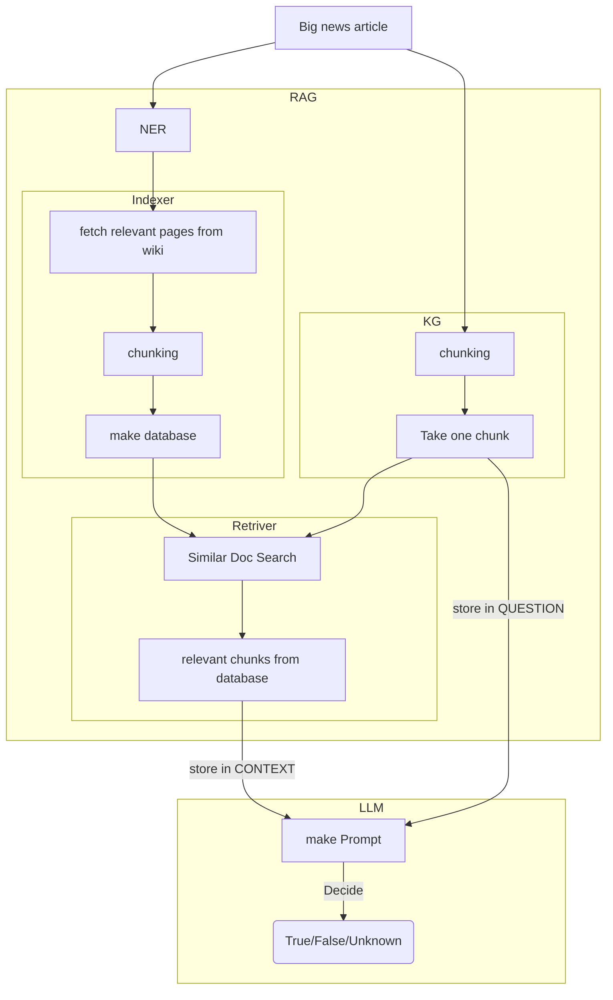

```mermaid
graph

A[Big news article] --> NER[NER]
A --> B[chunking]


subgraph RAG
NER --> E[fetch relevant pages from wiki]

subgraph KG
    B --> C[Take one chunk]
end

subgraph Indexer
    E --> F[chunking]
    F --> G[make database]
end
subgraph Retriver
    C --> S[Similar Doc Search]
    S --> H[relevant chunks from database]
    G --> S
end

end
subgraph LLM
    H --> |store in CONTEXT|K[make Prompt]
    C --> |store in QUESTION|K
    K --> |Decide|L(True/False/Unknown)

end

```
